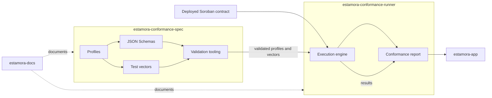

<div align="center">

# Estamora Soroban Layers

**Behavioural conformance tooling for Soroban smart contracts.**

A contract can expose every method of an interface with the exact expected signature, and
still lose user funds. Estamora measures what a contract *does*, not what it *looks like*.

[](https://github.com/Estamora-Soroban-Layers/estamora-conformance-spec/actions/workflows/ci.yml)
[](https://github.com/Estamora-Soroban-Layers/estamora-conformance-runner/actions/workflows/ci.yml)
[](https://github.com/Estamora-Soroban-Layers/estamora-docs/actions/workflows/ci.yml)
[](https://github.com/Estamora-Soroban-Layers/estamora-conformance-spec/blob/main/LICENSE)

</div>

---

## Watch the pitch

<a href="https://github.com/Estamora-Soroban-Layers/estamora-docs/releases/download/pitch-v1/estamora-pitch.mp4">
  
</a>

**[Five minutes, no sign-in.](https://github.com/Estamora-Soroban-Layers/estamora-docs/releases/download/pitch-v1/estamora-pitch.mp4)**
Every frame of it is a live deployment or output a program actually produced: the real
free-mint bug this project found in its own contract fixture, a real run of the release
binary, and the deployed application auditing a real conformance report. The pipeline that
builds the video is committed, so the figures in it can be corrected rather than argued with.

## The question Estamora answers

> Does this Soroban contract actually behave according to the standard or interface
> profile it claims to implement?

Not *does it compile*. Not *does it expose the expected methods*. Interface compatibility
is a **shape** claim. Behavioural conformance is a claim about **what happens**:

- which principal must authorize which call, and which arguments their authorization must cover;
- which events must be emitted, with what structure, and what they must correspond to in state;
- what a failed call must leave behind — including that it must emit nothing;
- which properties must survive every call, and which are exempt.

A contract that verifies *a* signature is present, without verifying *whose*, passes any
test that only asks whether the unauthorized call failed. It does fail — for the wrong
reason. That gap is what Estamora exists to make checkable.

## Repositories

| Repository | Language | What it is |
| --- | --- | --- |
| [`estamora-conformance-spec`](https://github.com/Estamora-Soroban-Layers/estamora-conformance-spec) | TypeScript | **Defines** conformance. Ten normative JSON Schemas, released profile bundles, the shared test-vector library, and the validation tooling that keeps them self-consistent. |
| [`estamora-conformance-runner`](https://github.com/Estamora-Soroban-Layers/estamora-conformance-runner) | Rust | **Measures** conformance. Executes profiles and vectors against a deployed Soroban contract and produces a deterministic verdict with JSON, Markdown and JUnit reports. |
| [`estamora-docs`](https://github.com/Estamora-Soroban-Layers/estamora-docs) | TypeScript | **Explains** conformance. The documentation site: guides, the behavioural model, profile authoring, and the generated reference set. |
| [`estamora-app`](https://github.com/Estamora-Soroban-Layers/estamora-app) | TypeScript | **Shows** conformance. The web application: inspect conformance evidence for live testnet contracts, with the documentation built in. |
| [`.github`](https://github.com/Estamora-Soroban-Layers/.github) | — | Community health files and this organization profile. |

## How the layers fit together



The separation is deliberate: the specification is a data format, and nothing in it
depends on the runner. A second implementation in another language is a supported
outcome, not a rewrite.

## Quickstart

The runner is distributed as source and as release binaries; no crate is published to
crates.io yet.

```bash
git clone https://github.com/Estamora-Soroban-Layers/estamora-conformance-spec
git clone https://github.com/Estamora-Soroban-Layers/estamora-conformance-runner
cd estamora-conformance-runner

# Build the runner, then measure a deployed contract against a released profile
cargo build --release --bin estamora

ESTAMORA_SPEC_REPO=../estamora-conformance-spec \
  ./target/release/estamora validate \
    --contract CB... \
    --profile sep-41@1.0 \
    --network testnet \
    --format markdown
```

Exit codes are a tested contract, not a convention:

| Exit code | Meaning |
| --- | --- |
| `0` | The contract conforms |
| `1` | The contract does not conform |
| `2` | The verdict is inconclusive, or the tooling failed — **never** "the contract is non-conformant" |

## Live on testnet

| Artifact | Location |
| --- | --- |
| Reference set (schemas, profiles, vectors) | <https://estamora-soroban-layers.github.io/estamora-conformance-spec/> |
| Worked conformance measurement against a real deployment | [`examples/testnet-contract/`](https://github.com/Estamora-Soroban-Layers/estamora-conformance-runner/tree/main/examples/testnet-contract) |
| Soroban testnet contract ID | [`CDB3EKMUGN5E7X2LMO56IB3A55EU4PPUYEF5EBVDKDV3LCLICJNSYKLW`](https://stellar.expert/explorer/testnet/contract/CDB3EKMUGN5E7X2LMO56IB3A55EU4PPUYEF5EBVDKDV3LCLICJNSYKLW) |

## Contributing

Every repository carries its own `CONTRIBUTING.md` describing how to build, test and
validate locally. Issues labelled
[`good first issue`](https://github.com/search?q=org%3AEstamora-Soroban-Layers+label%3A%22good+first+issue%22&type=issues)
are scoped to be completable without deep context, and
[`help wanted`](https://github.com/search?q=org%3AEstamora-Soroban-Layers+label%3A%22help+wanted%22&type=issues)
marks work that needs the model to be understood first.

Contributions to the **specification** are held to a different standard than code: a
change that alters what a profile requires is a **version change**, never an edit. See
[`VERSIONING.md`](https://github.com/Estamora-Soroban-Layers/estamora-conformance-spec/blob/main/VERSIONING.md).

## What Estamora does not do

- **Conformance is not security.** Passing a profile means a contract behaves as the
  profile defines. A profile that misses a failure mode does not detect it. Estamora does
  not replace formal verification, a security audit, penetration testing or vulnerability
  research, and must never be presented as doing so.
- **A result names a profile version.** `sep-41` is incomplete; `sep-41@1.0` is a claim.
- **The specification never claims a contract conforms.** It defines requirements. The
  runner measures, and its report carries the claim.

Report a defect in the specification itself, or a vulnerability anywhere in the stack,
through the process in [`SECURITY.md`](SECURITY.md). Private vulnerability reporting is
enabled on every repository.

## License

Apache-2.0, across every repository.
